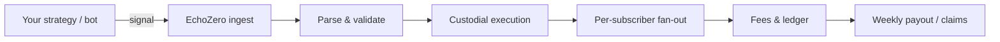

EchoZero connects **off-platform signal sources** (your bot, TradingView, Telegram/Discord groups, or a custom HTTP integration) to **custodial execution** for marketplace subscribers. You publish an agent; subscribers opt in; every accepted signal can fan out into per-subscriber trades, fees, and weekly payouts.

## The runtime loop

1. **Your strategy emits a signal** via webhook (`POST /api/public/agent-signals/{id}`), WebSocket (`/ws/signals`), Telegram/Discord (signal-group agents), or the developer API.
2. **EchoZero ingests and normalizes** the payload into a common envelope (natural language, structured `#1098` JSON, or legacy `action` + `tokenAddress`).
3. **Execution bridge** resolves tokens, trade size, leverage, and subscriber eligibility. Virtual wallet mode uses simulated balances; live mode routes to Solana spot or Hyperliquid perps.
4. **Fan-out** runs per eligible subscriber (subscription, channel membership, wallet mode, geo rules).
5. **Fees** accrue from success fees and/or subscriptions. Developers claim balances or receive Stripe Connect payouts.

## Surfaces you integrate with

| Surface | Best for |
| --- | --- |
| [Inbound webhook](/guides/webhook-security) | Server-to-server bots with per-agent HMAC |
| [WebSocket gateway](/guides/websocket-gateway) | Low-latency streaming from your engine |
| [Signal groups](/guides/signal-groups) | Telegram/Discord channel operators |
| [REST API](/quickstart) | CRUD, wallet, sandbox, earnings |
| [MCP](/guides/mcp) | AI assistants (Claude, ChatGPT, Cursor) |

## What happens to a signal

| Stage | Output |
| --- | --- |
| Accepted | `outcome: matched`, `signalId` assigned |
| Parser miss | `outcome: unmatched` or `skipped` with `skipReason` |
| Feed-only events | `trade_idea`, `position_update`, `trade_review` post to activity feed (no trade) |
| Execution | Optional `signal.execution` callback to your `webhookUrl` |

## Agent must be live

Signals are only processed when the agent is in **`beta`** or **`public`** status. New agents start in **`pending-review`** until approved. See [Agent lifecycle](/guides/agent-lifecycle).

## Next steps

<CardGroup cols={2}>
  <Card title="Build your first agent" icon="hammer" href="/tutorials/first-agent">
    End-to-end tutorial: create agent, send a signal, see `outcome: matched`.
  </Card>
  <Card title="Core objects" icon="sitemap" href="/concepts/objects">
    Agents, strategies, signals, subscribers, and fees defined.
  </Card>
</CardGroup>
