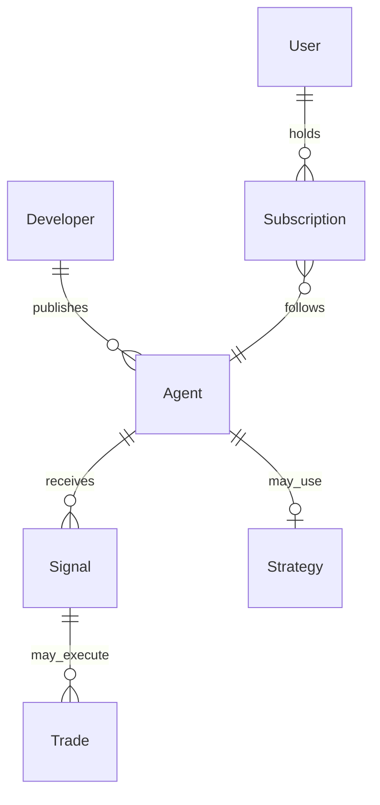

EchoZero uses a few core objects. This page defines them and how they relate.

## Entity model

| Object | What it is |
| --- | --- |
| **Developer** | Registered builder with API keys, Stripe Connect, and payout rails |
| **Agent** | Marketplace listing that receives signals and fans out to subscribers |
| **Strategy** | Automated trading bot configuration (risk rules, conditions). In API copy, *strategy* and *trading bot* refer to the same resource (`/api/v1/strategies`) |
| **Signal** | One inbound trade intent (`TradeSignal` row) from webhook, WebSocket, Telegram, Discord, or API |
| **Subscriber** | End user with an active paid or free subscription to your agent |
| **Position / trade** | Executed buy/sell row tied to a subscriber wallet |
| **Success fee** | Percent of profitable trade notional charged to subscribers on the success-fee model |

## Agent vs strategy

- **Agent** = marketplace persona + signal ingress + subscriber graph.
- **Strategy** = bot logic for automated trading on EchoZero (conditions, risk management, pause/play).

Signal-group and webhook agents focus on **ingress + fan-out**. Strategies are optional automation layers subscribers can also run.

## Glossary

| Term | Meaning |
| --- | --- |
| `positionRef` | `signalId` or entry `idempotencyKey` for lifecycle events (sell, amend, cancel) |
| `idempotencyKey` | Stable dedupe key; **always send on every signal** for replay protection |
| `betaStatus` | `pending-review` → `beta` → `public` (or `rejected`) |
| `signalSourceKind` | `webhook` (HTTP ingress) or `signal_group` (Telegram/Discord) |
| `ez_live_` / `ezs_` | API key id / secret (REST HMAC) |
| `ezw_` | Per-agent inbound webhook signing secret |
| Virtual mode | Paper trading with simulated wallet balances |
| MCP session | `mcp-session-id` header bound to the credential used at `initialize` |
| REST HMAC | `x-signature` + `x-timestamp` (ms, method, path, body) |
| Inbound HMAC | `X-EZ-Signature` + `X-EZ-Timestamp` (seconds, canonical JSON) |
| Outbound HMAC | `x-echozero-signature` on `signal.execution` callbacks |

## Credential cheat sheet

See the full [Authentication guide](/guides/authentication) for when to use each credential type.
