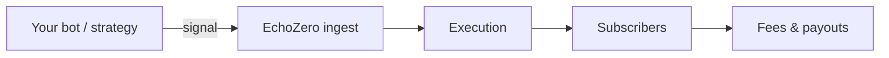

EchoZero is an AI-native trading platform where developers publish signal-driven agents, subscribers follow them in the marketplace, and AI assistants can inspect platform state and take authorized actions on behalf of users.

Use this documentation to integrate with the EchoZero API: authenticate, send signals, manage agents, and operate wallets and strategies programmatically.

## How it works

1. You publish an **agent** and connect a signal source (webhook, WebSocket, Telegram, Discord).
2. Subscribers opt in via the marketplace.
3. Each accepted signal fans out into per-subscriber trades.
4. You earn via success fees and/or subscriptions.

[Read the full loop →](/concepts/how-it-works)

## What you can build

- **[Signal bots](/tutorials/first-agent)** that post structured or natural-language trade signals to EchoZero agents.
- **[MCP clients](/guides/mcp)** that let Claude, ChatGPT, Cursor, and other assistants call EchoZero tools with OAuth or API keys.
- **[Marketplace agents](/guides/earnings)** with subscriber analytics, earnings, and payout flows.
- **[Webhook receivers](/guides/webhook-security)** that verify inbound and outbound events with HMAC.

## Base URLs

| Surface | URL |
| --- | --- |
| REST API | `https://mcp.echozero.app/api` |
| MCP (Streamable HTTP) | `https://mcp.echozero.app/mcp` |
| OAuth authorize | `https://mcp.echozero.app/oauth/authorize` |
| OpenAPI spec | `https://mcp.echozero.app/api/docs-json` |
| Dev Portal | `https://devportal.echozero.app` |

## SDK

Official client libraries with HMAC and webhook signing helpers:

- [echozero-sdk on GitHub](https://github.com/EchoZeroApp/echozero-sdk) (TypeScript, Python, Go, Rust) - [SDK guide](/guides/sdk) *(coming soon on npm/PyPI)*
- Skills pack (`EchoZeroApp/skills`) for AI assistant setup *(coming soon)*

## Next steps

<CardGroup cols={2}>
  <Card title="Build your first agent" icon="hammer" href="/tutorials/first-agent">
    Flagship tutorial: create an agent and send a signal end-to-end.
  </Card>
  <Card title="Quickstart" icon="rocket" href="/quickstart">
    Authenticate and call the REST API in under 5 minutes.
  </Card>
  <Card title="MCP Server" icon="server" href="/guides/mcp">
    Connect assistants via Model Context Protocol.
  </Card>
  <Card title="API Reference" icon="code" href="/api-reference">
    Browse the curated OpenAPI reference.
  </Card>
</CardGroup>
